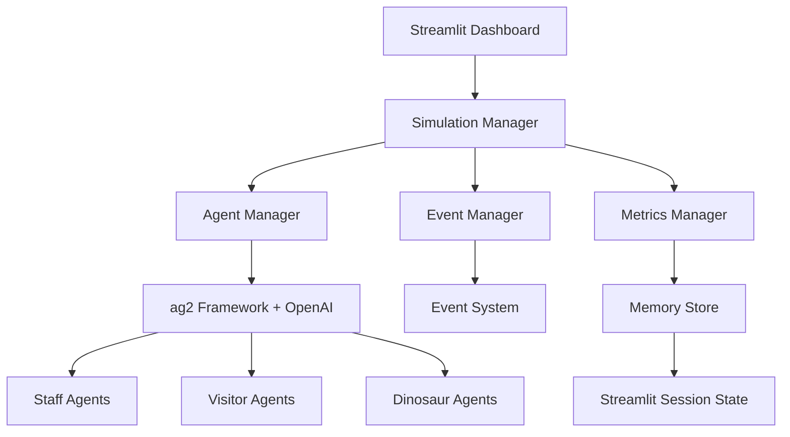

# Design Document

## Overview

The AI Agent Dinosaur Simulator is a multi-agent simulation system built with Python, leveraging the ag2 framework for agent orchestration and Streamlit for the user interface. The system simulates a dinosaur resort where AI agents with distinct personalities react to player-triggered events. The architecture follows a modular design with clear separation between the simulation engine, agent management, metrics tracking, and user interface layers.

## Architecture

The system follows a layered architecture with the following main components:



### Core Architecture Principles

1. **Event-Driven Design**: All system interactions are triggered by events that propagate through the agent network
2. **Agent Autonomy**: Each agent operates independently with its own decision-making logic
3. **Real-time Updates**: The UI reflects system state changes in real-time through Streamlit's reactive framework
4. **Modular Components**: Each major system component is loosely coupled and can be developed/tested independently

## Components and Interfaces

### 1. Simulation Manager

**Purpose**: Central orchestrator that coordinates all simulation activities

**Key Responsibilities**:
- Initialize and manage simulation state
- Coordinate between agents, events, and metrics
- Handle simulation lifecycle (start, pause, stop, reset)
- Maintain simulation clock and time progression

**Interface**:
```python
class SimulationManager:
    def start_simulation(self) -> None
    def trigger_event(self, event_type: str, parameters: dict) -> str
    def get_simulation_state(self) -> SimulationState
    def pause_simulation(self) -> None
    def reset_simulation(self) -> None
```

### 2. Agent Manager

**Purpose**: Manages all AI agents using the ag2 framework

**Key Responsibilities**:
- Initialize agents with distinct personalities and roles
- Route messages between agents through ag2
- Monitor agent health and performance
- Handle agent lifecycle management

**Interface**:
```python
class AgentManager:
    def initialize_agents(self, config: AgentConfig) -> List[Agent]
    def get_agent_states(self) -> Dict[str, AgentState]
    def broadcast_event(self, event: Event) -> None
    def get_agent_conversations(self) -> List[Conversation]
```

**Agent Types**:
- **Staff Agents**: Park rangers, veterinarians, security, maintenance
- **Visitor Agents**: Tourists with varying interests and risk tolerance
- **Dinosaur Agents**: Different species with unique behaviors and needs

### 3. Event Manager

**Purpose**: Handles event creation, distribution, and resolution tracking

**Key Responsibilities**:
- Define available event types and their parameters
- Trigger events and notify relevant agents
- Track event resolution progress
- Maintain event history and outcomes

**Interface**:
```python
class EventManager:
    def get_available_events(self) -> List[EventType]
    def create_event(self, event_type: str, parameters: dict) -> Event
    def distribute_event(self, event: Event) -> None
    def check_resolution_status(self, event_id: str) -> ResolutionStatus
```

**Event Categories**:
- **Dinosaur Events**: Escapes, illness, aggressive behavior
- **Visitor Events**: Injuries, complaints, emergencies
- **Facility Events**: Power outages, equipment failures
- **Weather Events**: Storms, extreme temperatures

### 4. Metrics Manager

**Purpose**: Tracks and calculates resort performance metrics

**Key Responsibilities**:
- Monitor visitor satisfaction scores
- Track dinosaur happiness and health metrics
- Calculate facility efficiency ratings
- Maintain historical metric data

**Interface**:
```python
class MetricsManager:
    def update_visitor_satisfaction(self, visitor_id: str, change: float) -> None
    def update_dinosaur_happiness(self, dinosaur_id: str, change: float) -> None
    def get_current_metrics(self) -> MetricsSnapshot
    def get_metric_history(self, metric_name: str, timeframe: str) -> List[MetricPoint]
```

### 5. Streamlit Dashboard

**Purpose**: Provides interactive user interface for simulation control and monitoring

**Key Components**:
- **Control Panel**: Event triggering, simulation controls
- **Agent Monitor**: Real-time agent status and conversations
- **Metrics Dashboard**: Current and historical performance data
- **Event Log**: History of triggered events and their resolutions

## Data Models

### Agent Model
```python
@dataclass
class Agent:
    id: str
    name: str
    role: AgentRole
    personality_traits: Dict[str, float]
    current_state: AgentState
    location: Location
    capabilities: List[str]
```

### Event Model
```python
@dataclass
class Event:
    id: str
    type: EventType
    severity: int
    location: Location
    parameters: Dict[str, Any]
    timestamp: datetime
    affected_agents: List[str]
    resolution_status: ResolutionStatus
```

### Metrics Model
```python
@dataclass
class MetricsSnapshot:
    visitor_satisfaction: float
    dinosaur_happiness: Dict[str, float]
    facility_efficiency: float
    safety_rating: float
    timestamp: datetime
```

### Simulation State Model
```python
@dataclass
class SimulationState:
    is_running: bool
    current_time: datetime
    active_events: List[Event]
    agent_count: int
    current_metrics: MetricsSnapshot
```

## Error Handling

### Agent Communication Failures
- **Retry Logic**: Implement exponential backoff for failed agent communications
- **Fallback Behavior**: Agents continue with default behaviors if communication fails
- **Isolation**: Failed agents are temporarily isolated to prevent cascade failures

### Event Processing Errors
- **Validation**: All events are validated before distribution
- **Partial Failure Handling**: Events can be partially processed if some agents are unavailable
- **Recovery Mechanisms**: Failed events can be retried or escalated

### UI Responsiveness
- **Async Operations**: Long-running operations use Streamlit's async capabilities
- **Progress Indicators**: Show progress for operations that take time
- **Error Messages**: Clear, actionable error messages for users

### Session State Management
- **State Persistence**: All data persists in Streamlit session state during the session
- **State Validation**: Session state is validated on each interaction
- **Reset Mechanisms**: Clean session reset functionality for new simulations

## Testing Strategy

### Unit Testing
- **Agent Behavior**: Test individual agent decision-making logic
- **Event Processing**: Verify event creation, distribution, and resolution
- **Metrics Calculation**: Validate metric computation accuracy
- **Data Models**: Test model validation and serialization

### Integration Testing
- **ag2 Framework Integration**: Test agent communication through ag2 with OpenAI
- **Session State Operations**: Verify data persistence in Streamlit session state
- **Event Flow**: Test complete event lifecycle from trigger to resolution
- **UI Integration**: Test Streamlit dashboard interactions

### System Testing
- **Multi-Agent Scenarios**: Test complex scenarios with multiple agents
- **Performance Testing**: Verify system performance under load
- **Stress Testing**: Test system behavior with many simultaneous events
- **User Acceptance**: Validate user experience and interface usability

### Test Data Management
- **Mock Agents**: Create predictable test agents for consistent testing
- **Event Scenarios**: Predefined event scenarios for regression testing
- **Metrics Validation**: Known-good metric calculations for comparison
- **Session State Fixtures**: Consistent test data for session state operations

## Implementation Considerations

### ag2 Framework Integration with OpenAI
- Use ag2's ConversableAgent as the base class for all agents with OpenAI LLM backend
- Leverage ag2's GroupChat for multi-agent conversations powered by OpenAI
- Implement custom agent roles using ag2's role-based messaging
- Use ag2's built-in logging for debugging and monitoring agent interactions
- Configure OpenAI API integration for agent reasoning and responses

### Streamlit Dashboard Design
- Implement real-time updates using Streamlit's session state
- Use Streamlit columns for organized layout
- Implement caching for expensive operations
- Use Streamlit's component system for custom visualizations

### Performance Optimization
- Implement agent pooling to manage resource usage and OpenAI API calls
- Use async operations for non-blocking event processing
- Cache frequently accessed data in session state
- Optimize OpenAI API usage with efficient prompt engineering

### Scalability Considerations
- Design for efficient OpenAI API usage with rate limiting
- Implement event queuing for high-volume scenarios
- Use session state efficiently to minimize memory usage
- Consider agent conversation optimization to reduce API costs